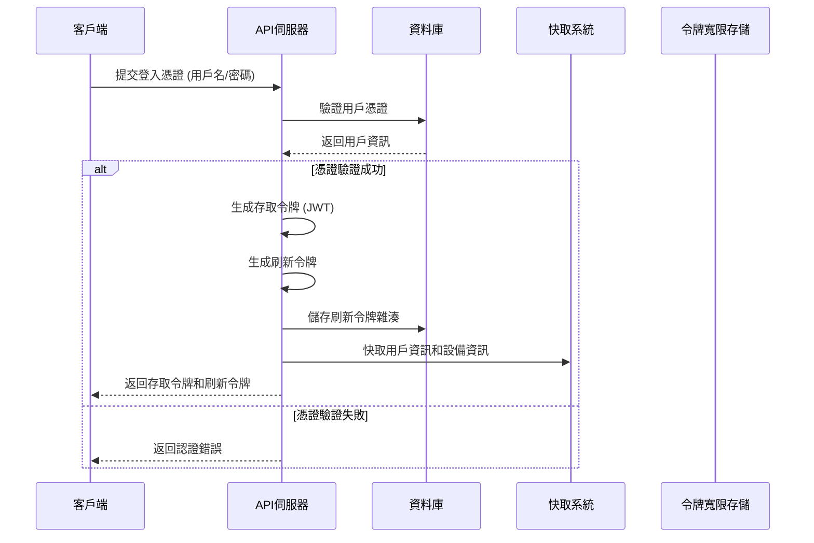
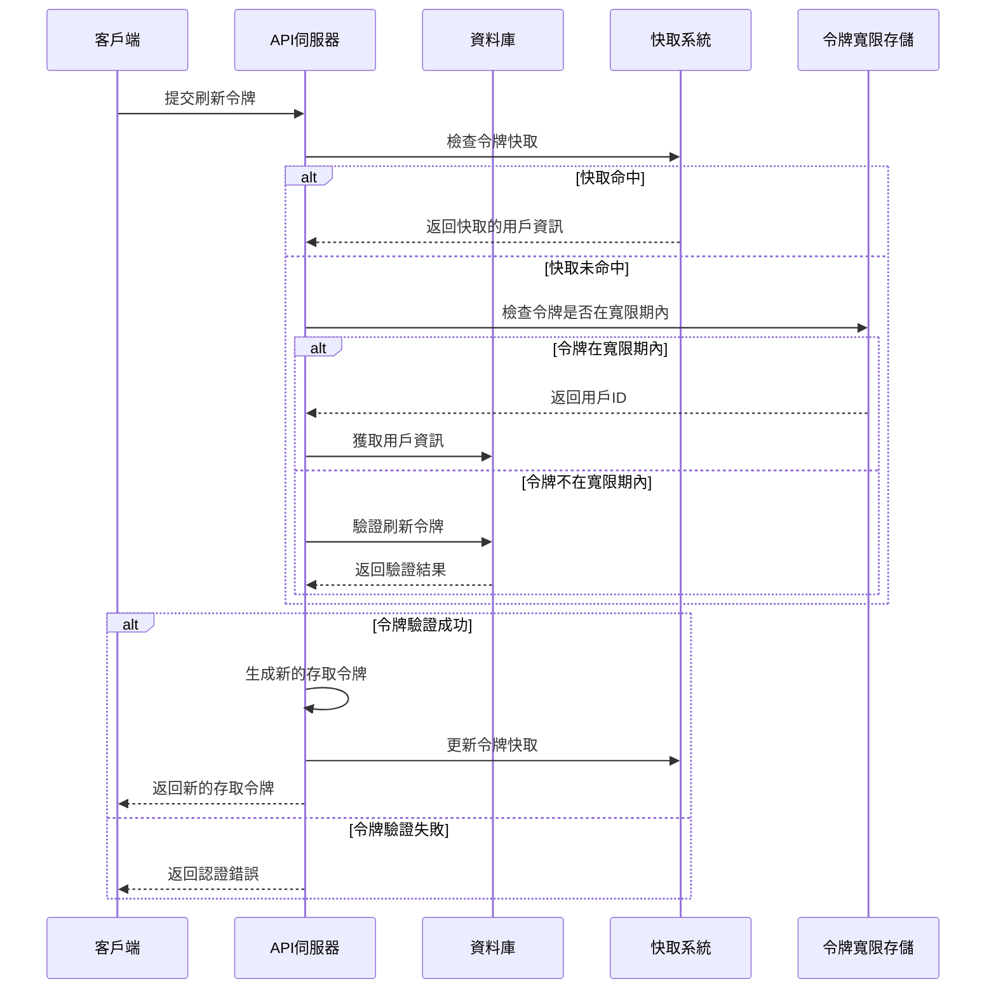
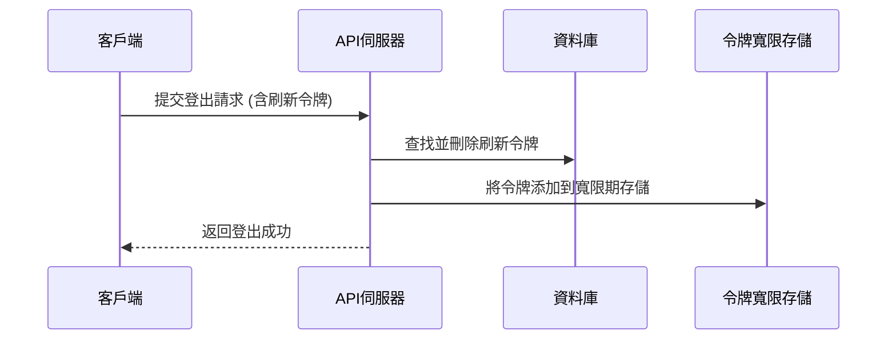

# 身份驗證流程圖

本文檔詳細說明了系統的身份驗證流程，包括登入、令牌刷新和登出過程，以及各環節的優化設計。

## 登入流程

### 登入流程說明

1. **憑證提交**：客戶端提交用戶名和密碼到伺服器
2. **憑證驗證**：伺服器查詢資料庫驗證用戶憑證
3. **令牌生成**：
   - 生成短期存取令牌 (JWT)，預設有效期 30 分鐘
   - 生成長期刷新令牌，預設有效期 90 天
4. **令牌儲存**：
   - 存取令牌僅返回給客戶端，不儲存在伺服器
   - 刷新令牌的雜湊值儲存在資料庫，原始令牌返回給客戶端
5. **快取機制**：快取用戶資訊和設備資訊，提高後續請求效能

## 令牌刷新流程

### 令牌刷新流程說明

1. **令牌提交**：客戶端提交刷新令牌
2. **多層驗證**：
   - 首先檢查令牌快取 (有效期 5 秒)
   - 若快取未命中，檢查令牌是否在寬限期內
   - 若不在寬限期內，查詢資料庫驗證令牌
3. **令牌更新**：
   - 生成新的存取令牌
   - 更新令牌快取
   - 返回新的存取令牌給客戶端
4. **優化機制**：
   - 使用令牌指紋作為快取鍵
   - 實施非阻塞令牌鎖定機制
   - 批次處理刷新請求
   - 動態調整刷新閾值

## 登出流程

### 登出流程說明

1. **登出請求**：客戶端提交登出請求，包含刷新令牌
2. **令牌刪除**：伺服器從資料庫中刪除刷新令牌
3. **寬限期處理**：將令牌添加到寬限期存儲，處理可能的並發請求
4. **響應返回**：返回登出成功響應給客戶端

## 配置參數

| 參數名稱 | 預設值 | 說明 |
|---------|-------|------|
| ACCESS_TOKEN_EXPIRE_MINUTES | 30 | 存取令牌有效期（分鐘） |
| REFRESH_TOKEN_EXPIRE_DAYS | 90 | 刷新令牌有效期（天） |
| TOKEN_CACHE_EXPIRATION | 5 | 令牌驗證快取有效期（秒） |
| REFRESH_CACHE_EXPIRATION | 45 | 刷新結果快取有效期（秒） |
| GRACE_PERIOD_SECONDS | 300 | 令牌寬限期（秒） |

## 優化設計

1. **多層驗證策略**：
   - 輕量級初步驗證：快速過濾明顯無效的令牌
   - 快取驗證：減少資料庫查詢
   - 寬限期機制：處理令牌更新期間的並發請求

2. **效能優化**：
   - 非阻塞令牌鎖定：使用線程安全的鎖機制
   - 批次處理：合併短時間內的多個刷新請求
   - 智能快取清理：使用非阻塞線程進行快取維護

3. **安全性設計**：
   - 令牌雜湊存儲：資料庫中僅存儲令牌雜湊值
   - 設備識別：跟踪不同設備的令牌使用情況
   - 自動清理：定期清理過期和已撤銷的令牌 