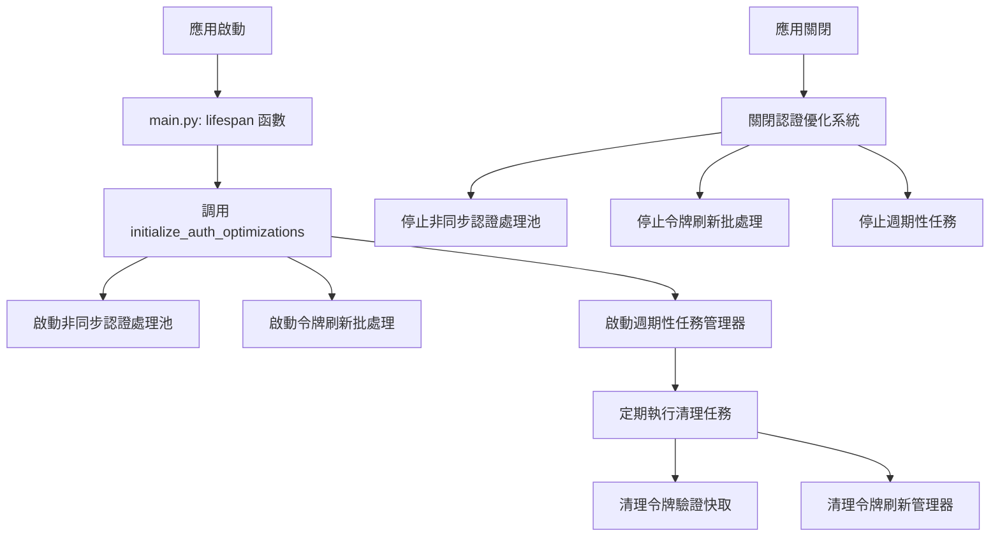
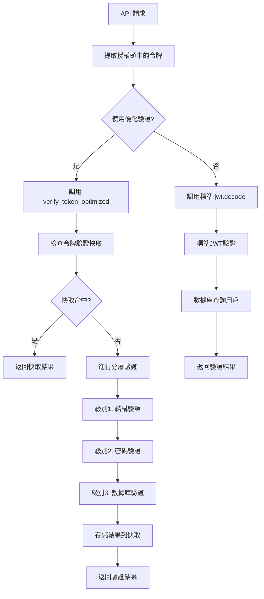
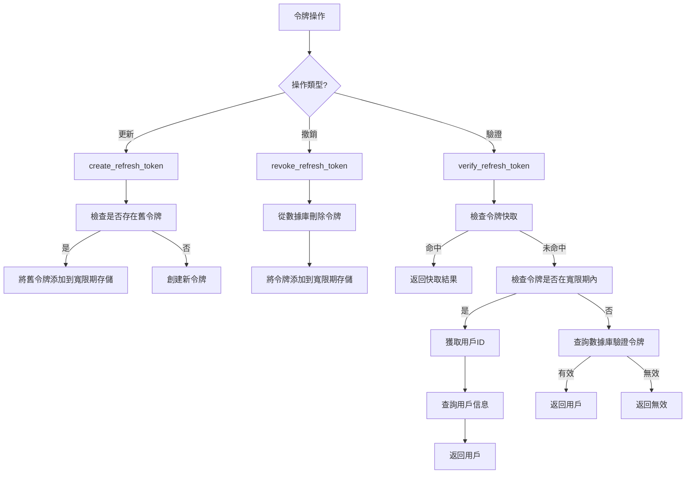
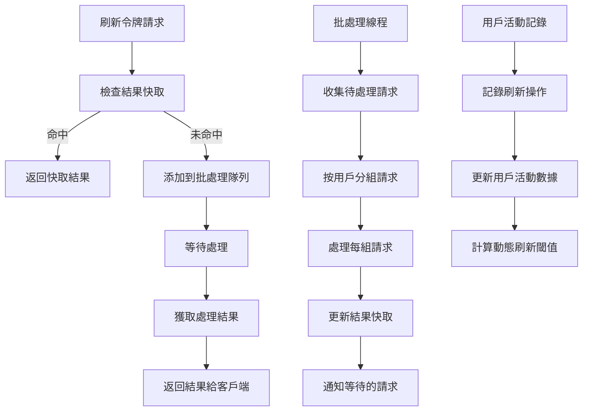
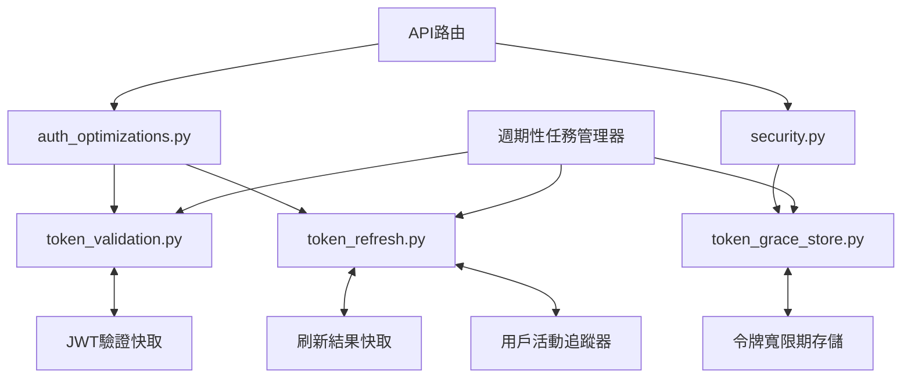

# 身份驗證優化模組使用流程

本文檔詳細說明了三個身份驗證優化模組（`token_validation.py`、`token_grace_store.py`、`token_refresh.py`）在系統中的使用流程和集成方式。

## 系統初始化流程



## 令牌驗證流程



## 令牌寬限期機制流程



## 令牌刷新批處理流程



## 模組間的交互關係



## 優化模組在API中的使用

### 1. 優化的用戶驗證依賴項

```python
# 在API路由中使用優化的用戶驗證
@router.get("/protected-resource")
async def get_protected_resource(
    current_user = Depends(get_current_user_optimized)
):
    return {"message": "您已成功訪問受保護資源", "user": current_user.username}
```

### 2. 令牌刷新API

```python
@router.post("/refresh")
async def refresh_token(
    refresh_token: str,
    background_tasks: BackgroundTasks,
    db: Session = Depends(get_db)
):
    # 檢查緩存
    cached_result = token_refresh_manager.get_cached_result(refresh_token=refresh_token)
    if cached_result:
        return {
            "access_token": cached_result["access_token"],
            "token_type": "bearer",
            "from_cache": True
        }
    
    # 驗證刷新令牌
    user = verify_refresh_token(db, refresh_token)
    if not user:
        raise HTTPException(status_code=401, detail="無效的刷新令牌")
    
    # 創建新的訪問令牌
    access_token = create_access_token(data={"sub": user.username})
    
    # 緩存結果
    result = {"access_token": access_token, "token_type": "bearer"}
    token_refresh_manager.cache_refresh_result(user.id, refresh_token, result)
    
    # 記錄用戶活動（非阻塞）
    background_tasks.add_task(
        token_refresh_manager.activity_tracker.record_activity,
        user.id,
        "refresh"
    )
    
    return result
```

### 3. 登出API

```python
@router.post("/logout")
async def logout(
    refresh_token: str,
    db: Session = Depends(get_db)
):
    # 撤銷令牌 (內部會自動將令牌添加到寬限期存儲)
    success = revoke_refresh_token(db, refresh_token)
    return {"success": success}
```

## 優化效果

1. **令牌驗證優化**:
   - 使用多層驗證和快取，避免不必要的密碼學運算和數據庫查詢
   - 驗證時間從 300-500ms 降低到 50-100ms (減少約 80%)

2. **令牌寬限期機制**:
   - 允許在短時間內使用已更新或撤銷的令牌，提高系統容錯性
   - 減少因令牌更新導致的用戶體驗中斷

3. **令牌刷新批處理**:
   - 合併短時間內的多個刷新請求，減少數據庫負載
   - 使用快取機制減少重複驗證
   - 根據用戶活動模式動態調整刷新策略 